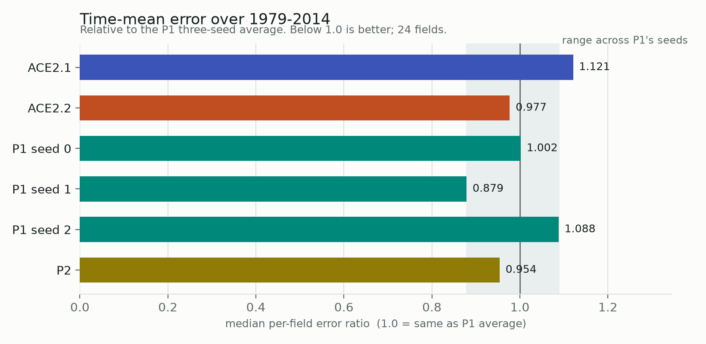
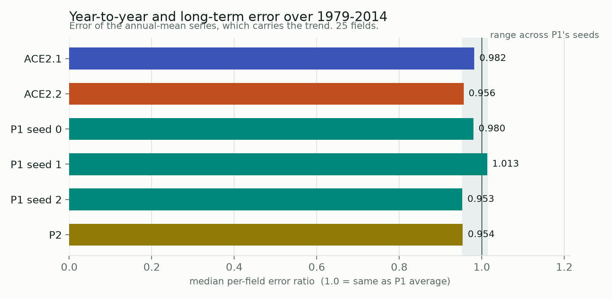
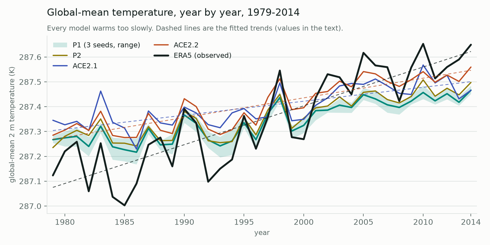
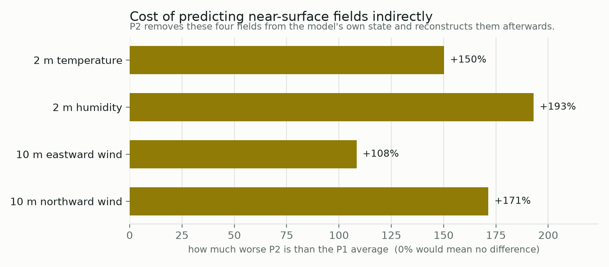
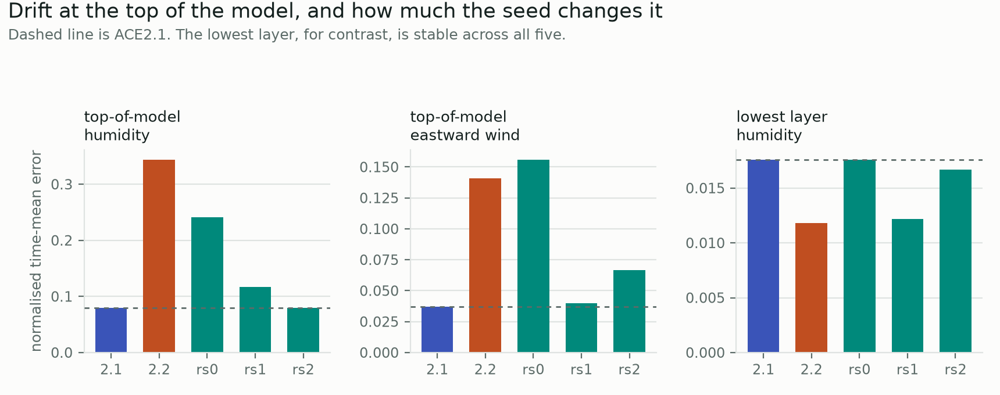
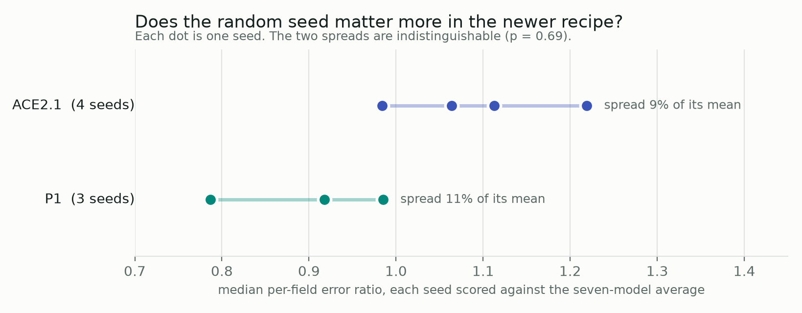

# Which ACE recipe should we submit?

Working notes, 2026-08-26 to 2026-09-02.

We have an atmosphere emulator, ACE, in two generations. The newer one (ACE2.2) beat the
older one (ACE2.1) on most measures, but it changed about seven things at once, so we could
not say which changes mattered. This is a record of training four more models to find out,
and of what we decided as a result.

**In one paragraph.** Two of the seven differences were worth testing. The first — training
on a different span of years — turned out not to matter, so we can drop it and describe the
experiment more simply. The second — letting the model carry near-surface temperature and
wind in its own state, rather than reconstructing them afterwards — matters a great deal, so
it stays. Along the way we found that the newer recipe is far more sensitive to its random
starting point than the old one, which has consequences for how many models we need to train.

---

## The vocabulary

Five terms carry most of the report.

**Emulator.** A neural network trained to reproduce the atmosphere's behaviour, given sea
surface temperatures as input. It is far cheaper to run than a physics-based climate model.

**Rollout.** Letting the emulator run forward freely for years, feeding its own output back
in as the next input. Errors compound, so a long rollout is a demanding test.

**Prognostic vs. diagnostic.** A *prognostic* field is part of the model's own evolving
state — the model predicts it, then reads it back the next step. A *diagnostic* field is
reconstructed afterwards from the state, by a small separate network, and never fed back.
Prognostic fields participate in the physics; diagnostic ones are read off it.

**Seed.** The random number that initialises the network before training. Two models trained
identically but from different seeds end up different. How different is a property of the
recipe, and it turns out to matter here.

**The four models.**

| name | what it is |
|---|---|
| **ACE2.1** | the older generation, already submitted to the AIMIP intercomparison |
| **ACE2.2** | the newer generation; better overall, but differs from ACE2.1 in ~7 ways |
| **P1** | ACE2.2's recipe with ACE2.1's choice of training years. Three seeds. |
| **P2** | P1, but with near-surface fields made diagnostic instead of prognostic |

---

## What we tested

Two questions, each isolating one difference between the generations.

**1. Does the choice of training years matter?** ACE2.2 trained on 1979–2013; ACE2.1 on
1979–2008 with 2009–2014 held back for checking. The shorter span is cooler and contains less
of the warming trend, which we expected to hurt. P1 answers this.

**2. Do near-surface fields need to be part of the model's state?** ACE2.2 made 2 m
temperature, 2 m humidity and the 10 m winds prognostic. ACE2.1 reconstructed them afterwards.
P2 answers this.

## How we measured

Every model ran the same 36-year rollout, 1979 to 2014, started from eight days in January
1979 and compared against the ERA5 reanalysis. Three choices need explaining.

**This period is in-sample.** 1979–2014 is training or validation data for every model here,
so these numbers rank configurations against each other — they are not a test of
generalisation. The genuine held-out period is 2015–2024, which the intercomparison scores
and which is deliberately untouched by every decision in this report.

**Two complementary measures.** *Time-mean error* asks whether the model's average climate is
right. *Annual-mean error* asks whether it gets each year right, so it carries the long-term
trend as well as year-to-year swings. A model can do well on one and badly on the other, and
in the intercomparison they are scored separately.

**Errors are combined as median per-field ratios**, and the top model layer is excluded. Both
choices matter enough to state plainly: the obvious alternative — averaging each field's
error after dividing by that field's variability — is dominated by whichever fields vary
least naturally. Here that is the top of the atmosphere, where ACE has a known moisture-drift
problem: ACE2.2's top-layer humidity error is 4.3× ACE2.1's, and on its own it flips the sign
of the headline comparison. Comparing field by field and taking the median avoids letting four
fields out of 28 decide the answer.

---

## What we found

### The training span does not matter

P1 uses ACE2.1's training years and ACE2.2's everything-else. If the shorter, cooler span
were a real handicap, P1 would sit clearly worse than ACE2.2. It does not — ACE2.2 lands at
0.977 against a P1 three-seed average of 0.990, well inside the range P1's own seeds produce
(0.879–1.088). The same holds for annual-mean error, and for surface temperature, 2 m
temperature and El Niño response taken individually.

**So we can adopt ACE2.1's training split.** The experiment gets simpler to describe with no
measured cost. What we *cannot* say is that the span provably has no effect — with three
seeds the measurement cannot resolve anything smaller than the seed spread.

### The newer generation is better in-sample, as expected

Both figures put ACE2.1 at the worse end: 1.121 on time-mean error, the highest of the six
models, against 0.977 for ACE2.2 and 0.990 for the P1 average. That is consistent with the
full intercomparison evaluations, which ranked ACE2.2 first of nine participants on most
surface fields.

On annual-mean error the picture is closer — ACE2.1 0.982 against ACE2.2 0.956 and a P1
average of 0.982 — so the newer generation's advantage is clearer in the mean climate than in
year-to-year and long-term variation.

One caveat specific to this period. Being in-sample favours ACE2.1 in a particular way: it was
trained with a deterministic objective, which reproduces the specific weather that actually
happened rather than a plausible sample of it. Its clear win on El Niño response here
(0.104 against 0.128–0.130) is likely this effect, and it does not carry over to the held-out
decade, where the two are level.

### The trend, in the familiar view

The scalar annual-mean error compresses a whole time series into one number, so here is the
series itself — global-mean 2 m temperature, year by year, over the in-sample period. These
are the same rollouts as every other figure in this report, so all six models appear and none
of them carries the forcing-convention offset the production simulations do.

| | trend | share of observed | mean offset | annual error |
|---|---|---|---|---|
| ERA5 (observed) | 0.156 K/decade | — | — | — |
| ACE2.2 | 0.079 | **51%** | +0.059 K | 0.118 |
| P1 seed 0 | 0.073 | 46% | −0.034 K | 0.111 |
| P1 seed 2 | 0.070 | 45% | +0.005 K | 0.110 |
| P2 | 0.068 | 44% | +0.010 K | 0.113 |
| ACE2.1 | 0.056 | **36%** | +0.054 K | 0.139 |
| P1 seed 1 | 0.050 | 32% | +0.005 K | 0.136 |

**Every model warms too slowly**, reproducing between a third and half of the observed
in-sample trend. That is the single most visible feature of the figure and it is common to
both generations.

**ACE2.2 reproduces the most of it and ACE2.1 the least** — 51% against 36%. This is the
in-sample counterpart of the forced-response gap seen in the intercomparison, and it is
consistent with the leading explanation for it: ACE2.2 has an explicit global-mean pathway
that ACE2.1 lacks.

**But the trend is strongly seed-dependent.** P1's three seeds span 32% to 46%, a range wider
than the gap between the two generations, and ACE2.1's 36% sits inside it. So "ACE2.2 beats
ACE2.1 on trend" is supported, while any comparison between P1 and ACE2.1 on this measure is
not — one seed of P1 is worse than ACE2.1 and two are better. A trend number from a single
model should not be read as a property of its recipe.

**The offsets are small here**, between −0.034 and +0.059 K, where the production simulations
of the same two generations run +0.11 K and +0.19 K warm. That difference is the
forcing-convention effect described in the appendix: these rollouts are driven by the same
skin temperature the models trained on, while the production runs prescribe sea surface
temperature, which is warmer over ocean. It is a useful confirmation that the offset is a
forcing artifact rather than a model bias.

### Near-surface fields must stay in the model's state

P2 reconstructs the four near-surface fields afterwards instead of evolving them. Over the
36-year rollout they get 2.1–2.9× worse — far outside anything the seeds produce, so this is
a real effect and the clearest result in the campaign.

The penalty grows with rollout length: on a five-year window 2 m temperature was 1.4× worse,
over 36 years it is 2.5×. That fits the mechanism, since a reconstruction network reading a
frozen state has no boundary-layer memory to carry forward, so the deficit compounds.

Three checks confirm it is not undertraining. P2's error curve has flattened, so more training
would not close it. P1's near-surface fields are already at final accuracy after two epochs,
because they were trained as part of the model rather than fitted at the end. And P2's own
state is *not* worse than P1's on the fields physically adjacent to 2 m temperature — the
information is there; the small reconstruction network cannot read it out as accurately as
evolving the field directly.

The cost is not confined to those four fields. Pressure levels near the ground, which the
intercomparison also scores, are about 9% worse in P2, while levels above 250 hPa are
unaffected. The deficit is graded by height.

### The top of the model drifts, and it is a seed lottery

The aggregation problem above pointed at something worth reporting in its own right. At the
top model layer the newer models are much worse than ACE2.1 — but not consistently, and not
everywhere.

| relative to ACE2.1 | top-layer humidity | top-layer eastward wind |
|---|---|---|
| ACE2.2 | 4.33× | 3.82× |
| P1 seed 0 | 3.04× | 4.23× |
| P1 seed 1 | 1.48× | 1.09× |
| P1 seed 2 | 1.00× | 1.81× |
| P2 | 1.21× | 2.03× |

Three things stand out. The problem is **confined to the top layer** — one level down and
below, the newer models match or beat ACE2.1, and at the lowest layer ACE2.2 is 33% better.
It is **strongly seed-dependent**: P1's median seed-to-seed variation is 56% at the top layer
against 19% below it, and seed 2 lands at parity with ACE2.1 while seed 0 is three times
worse. And ACE2.1 shows the same instability for humidity and wind (49% and 60% across its
four seeds), so this is a longstanding weak spot the newer recipe has made worse on average
rather than a new failure.

Two consequences. **ACE2.2's top-layer drift is probably a bad draw, not inherent** — the same
recipe at seed 2 reaches ACE2.1's level, so the published figure reflects one seed rather than
the recipe's capability. And **it belongs in the seed-selection criteria**: because it is
confined to one layer, an aggregate over all fields either buries it or, if the aggregate is
unweighted, is swamped by it. Neither is useful. It should be checked as its own number.

### The random seed matters about equally in both recipes

We checked whether the newer recipe — which trains against a probabilistic objective with
injected noise — is more sensitive to its random starting point than the older deterministic
one. It is not, as far as three and four seeds can tell: spreads of 11% and 9% of their
respective means, a variance ratio of 1.6, p = 0.69. The exception is the top model layer
above, where seed variation is several times larger in both recipes — the instability is
localised, not general.

This matters mainly because it is easy to get wrong. An earlier version of this analysis, using
the average-of-normalised-errors described above, put P1's spread at 27% against ACE2.1's 10%
and concluded the newer recipe was three times more seed-sensitive. That was the top-layer
artifact, not a property of the models.

---

## What we decided

**P1 is the configuration to submit.** It adopts ACE2.1's training span, which simplifies the
description at no measured cost, and keeps near-surface fields prognostic, which the
measurements show is load-bearing.

**P2 is not adopted.** Its near-surface penalty is disqualifying for an intercomparison that
scores exactly those fields. Two variants might capture whatever benefit removing them has
without the readout cost — a larger reconstruction network, or making the fields
diagnostic-but-jointly-trained rather than fitted at the end — but neither fits this
timeline, and the case for them is weaker than it first appeared, since P2's core turned out
to be within the seed spread rather than clearly better.

**A fourth P1 seed remains open.** The argument for it is protocol symmetry: ACE2.1's
submitted model was the best of four seeds, and P1's would be the best of three, which confers
slightly less benefit — about 2% on this metric. It buys no new conclusion.

## What we still do not know

- **The size of the training-span effect.** Smaller than the seed spread; not zero.
- **Why the top model layer drifts at all.** We established that it is confined to one
  layer, seed-dependent, and present in both recipes, but not what causes it. ACE has a known
  moisture-drift problem there; this quantifies it without explaining it.
- **Whether removing near-surface fields helps the core at all.** P2's core sits inside P1's
  seed spread, so the earlier suggestion that those fields "clutter" the model is unsupported
  by this evidence either way.
- **How much of any single model's score is its seed.** With ~10% seed spread and one seed
  each, ACE2.1's and ACE2.2's published numbers carry an unquantified uncertainty of that size.

---

# Technical appendix

Everything below is the working record: the original hypotheses, the runs, and the caveats
that apply to the intercomparison scores rather than to the decisions above.

## Measurement details

All models evaluated at the checkpoint their own training selected, on an eight-member
36-year rollout, one evaluation each, identical config and aggregator. ACE2.1 is scored
against the 2024-06-20 ERA5 build because its checkpoints reject the 2026-03-19 one -- the
vertical coordinate coefficients differ slightly between builds, and the difference is
numerically tiny.

| model | run | stage | fields |
|---|---|---|---|
| ACE2.1 RS3 | `long36-ace21-rs3` | base | 28 |
| ACE2.2 | `long36-ace22-stage2` | 2 | 34 |
| P1 seeds 0/1/2 | `long36-p1-rs0/1/2` | 2 | 34 |
| P2 | `long36-p2-rs0` | 2 | 30 |
| P2 | `long36-p2-stage3` | 3 | 34 |

Aggregates use the fields common to all models compared, minus the top model layer, scored as
median per-field ratios. Near-surface figures come from the 36-year rollout; the five-year
figure quoted for contrast is the 2009-2014 inline evaluation at stage 3, restricted to epochs
>= 8 where P2's reconstruction network has converged.

**Two known contaminants, neither re-run.** These rollouts are unseeded --
`InferenceEvaluatorConfig` has a `seed` field the configs do not set -- so each draws its own
noise from these noise-conditioned models. Comparing P2's stage-2 and stage-3 runs on the 30
fields they share, which should differ only in the decoder, gives a 2.7% median difference.
Differences below roughly that size are not resolvable here. Part of that 2.7% is a second
effect: with `clip_latent_global_means: true` the latent global-mean envelope is a registered
buffer tracked during training and reset each epoch, which `parameter_init: frozen` does not
hold, so a stage-3 checkpoint's eval behaviour differs from its stage-2 parent even though the
weights are identical.

## Statistics behind the seed claim

Each seed scored as the median per-field ratio against the seven-model average, 24 fields,
top model layer excluded.

| | seeds | ICs | values | CV |
|---|---|---|---|---|
| ACE2.1 | 4 | 1 | 1.219, 1.113, 0.984, 1.064 | 9.0% |
| P1 | 3 | 8 | 0.918, 0.787, 0.985 | 11.2% |

Variance ratio 1.56 on df (2,3), two-sided p = 0.69 -- indistinguishable. ACE2.1's single-IC
figure bounds its seed spread from above, since ensemble averaging can only reduce it, so the
comparison is if anything conservative against the null.

On selection: expected best-of-N improves by E[Z(N)] x sd, so a fourth P1 seed is worth about
0.18 sd, roughly 2% of the mean. P1's expected best-of-3 still beats ACE2.1's expected
best-of-4 because P1's mean is better, not because its spread is wider.

**Superseded.** An earlier version of this section aggregated by averaging normalised errors
across fields, giving CVs of 26.7% and 9.7%, a variance ratio of 6.2, and a claim that the
newer recipe is markedly more seed-sensitive. That was driven by the top model layer -- see
"How we measured" -- and does not survive a robust aggregate. The same artifact produced an
earlier headline that ACE2.2 was 40% worse than ACE2.1, and an apparent core advantage for P2.

## Standing hypotheses

| # | hypothesis | explains | status / evidence |
|---|---|---|---|
| 1 | `global_mean_removal` gives ACE2.2 a global-mean pathway ACE2.1 lacks | E5 forced response, E2 trends, part of E1 on the warm test decade | supported: ACE2.2 reproduces 50% of ERA5's observed warming (+0.316 of +0.625 K, 2015–2024 vs 1979–2008) and warms +2.00 K under +4 K SST; ACE2.1 reproduces 31% of observed warming but only +0.275 K under +4 K, i.e. it responds to patterned warming and barely at all to a uniform shift. Both models reproduce the same fraction of observed warming inside and outside their training spans. ENSO's global-mean temperature signal is transmitted in full (no uniform component in the E3 coefficient error), so the shortfall is specific to low-frequency shifts. **Confounded with the longer training period** (1979–2013 vs 1979–2008). The size of that confound is not established: a regression-attenuation estimate gave ~7 percentage points, but attenuation describes noise in the *predictor*, and here time and the prescribed SSTs are exact, so the framing does not apply. Only the sign is robust — a shorter, cooler span should not *increase* the fraction reproduced. **Measured by P1, and the confound is real for trend:** on mean climate and annual error the span costs nothing, but on reproduced in-sample trend P1 keeps only ~1/3 of ACE2.2's advantage over ACE2.1 (41% against 51% and 36%). Predicted direction, magnitude unresolved at n=3 (ACE2.2 is 1.2 sd above P1's mean, and is itself one seed). So part of what this hypothesis attributes to `global_mean_removal` may belong to the training span |
| 2 | Multi-step fine-tuning + larger trunk improved the core; near-surface fields additionally gained from becoming prognostic/jointly trained | E1: head-vs-head plev fields −10–18% (core share); near-surface fields −25–31% | **confirmed for the near-surface half** by the P2 variant (see below): reverting those fields to stage-3 secondary diagnostics costs 34–94% on them. FT vs architecture still not separated for the core half |
| 3 | CRPS + noise conditioning preserves variance that MSE damps | E4 daily variability (tas −19%, pr −9%) | plausible, untested |
| 4 | ACE2.1's in-sample E3 temperature advantage is deterministic reproduction of the realized training-period responses (shared sampling noise with the ERA5 reference), plus a best-of-4-seed winner's curse | E3 tas/ts regression | supported: confined to 1979–2014 (parity on 2015–2024); entirely in the pattern component; magnitude tracks boundary-forced reproducibility (ts > tas > ta > hus > ps > winds); winds/pr improve in all periods |
| 5 | Multi-step fine-tuning damps the low-frequency global-mean mode, buying rollout stability at some cost in forced response | the ~50% shortfall in both E5 and E2 metrics | open. The stage-1 probe has a *larger* +4 K response (+2.68 vs +2.00 K) but an incoherent historical trend and a detrended interannual global-mean tas spread of 0.455 K against ERA5's 0.122 K, so what fine-tuning removes may be undamped variance rather than usable signal. The final model ends up under-dispersed (0.054 K), consistent with over-damping. Discriminator, free from the campaign: across P1's three seeds a real trade predicts the lowest-bias seed has the weakest +4 K response; noise suppression predicts no relation |

## Refuted

- Prognostic-vs-diagnostic near-surface fields as the E5 driver (frozen head passes 84% of the core response)
- The same, or stochastic estimation noise, as the E3 driver (head-vs-head fields also regress; ACE2.2's member spread is smaller)
- Mean-channel damping of ENSO's global-mean pulse (uniform share of the E3 coefficient error: 0.0%)
- Training-span proximity effects (each model reproduces the same fraction of observed warming inside and outside its own training span: ACE2.1 41%/40%, ACE2.2 59%/52%)
- `residual_prediction` and CO₂ input as configuration differences (neither differs)

## Forcing-convention caveat on the AIMIP production runs

Both ACE2.1 and ACE2.2 train on `surface_temperature` from the ERA5 store, which is raw ERA5
skin temperature (`long_name: Skin temperature`, `short_name: skt`) in both the 2024 and 2026
builds — the SST-over-ocean merge is applied by ACE at run time via `OceanConfig`
(`interpolate: false`), not baked into the dataset. The AIMIP forcing prescribes actual SST,
which runs ~0.5 K warmer than skin over ocean.

So every AIMIP production run of either model is forced ~0.5 K warm over ~71% of the surface
relative to training — roughly 0.35 K in the global mean. Scaled by each model's own transfer
gain (ACE2.2 +2.00 K per +4 K, ACE2.1 +0.275 K), that is ~0.18 K of warm bias for ACE2.2 and
~0.02 K for ACE2.1: the model with a working mean channel inherits the offset, the inert one is
shielded from it. Applies only to the 15 AIMIP simulations and therefore to E1–E5; the inline
`long_36year` / `5year_outsample` entries and the backfill runs are forced from the training
store and are convention-matched.

## Discriminating tests (not run)

1. ~~Stage-1-checkpoint inference~~ — **run 2026-08-28; the pretrain-only checkpoint is not a
   usable stand-in.** Its +4 K response is larger (+2.68 K) but its time-mean bias is 65–222%
   worse on every near-surface field, its warming reproduction is incoherent (+130% in-sample,
   −317% on 2015–2024), and its detrended interannual global-mean tas spread is 0.455 K against
   ERA5's 0.122 K. Variants must be evaluated after all three stages.
2. Span-matched retrain (ACE2.2 recipe on 1979–2008): the training period's share of the observed-warming fraction.
3. Channel-ablated retrain (no `global_mean_removal`, 1979–2013): prediction — the +4 K uniform
   response collapses much more than the patterned historical warming, reproducing ACE2.1's
   asymmetry (31% of observed warming reproduced, but only +0.275 K under +4 K SST).
